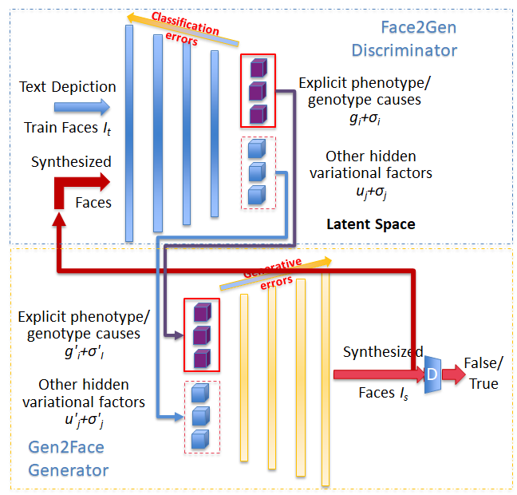

## geneGAN: self-supervised deep modelling of phenotype-genotype nexus

Considering a biometrics is defined by gene, how could we discover the underlying genotype-phenotype relationship? To address this challenge, we proposed a novel geneGAN architectre to capture the underlying ties between facial appearance (phenotypes) and its associated genotypes (genes).

### Archtecture of geneGAN

